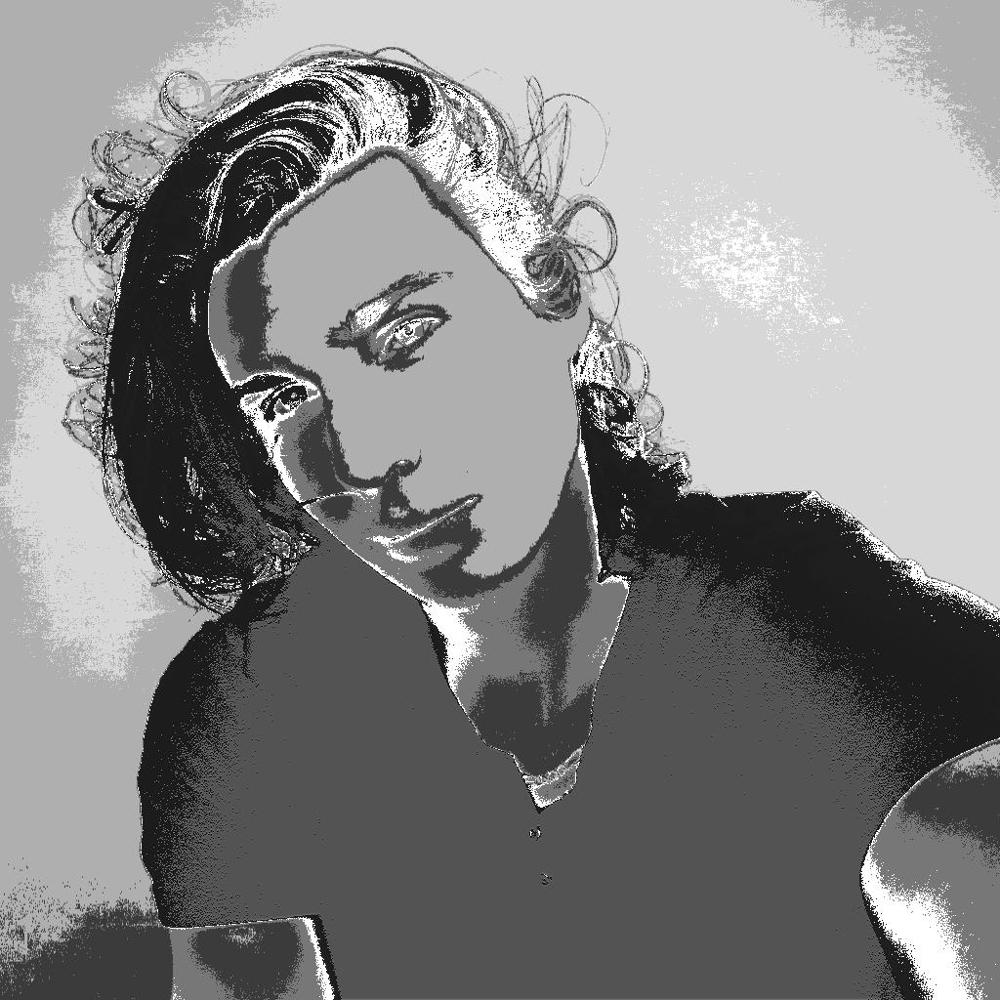
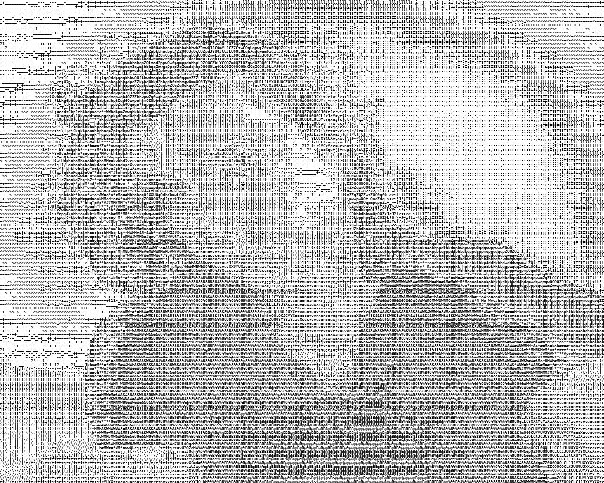
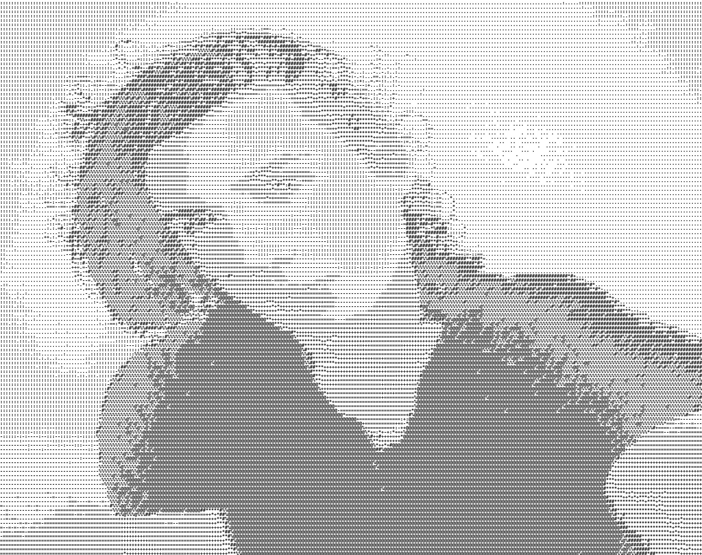
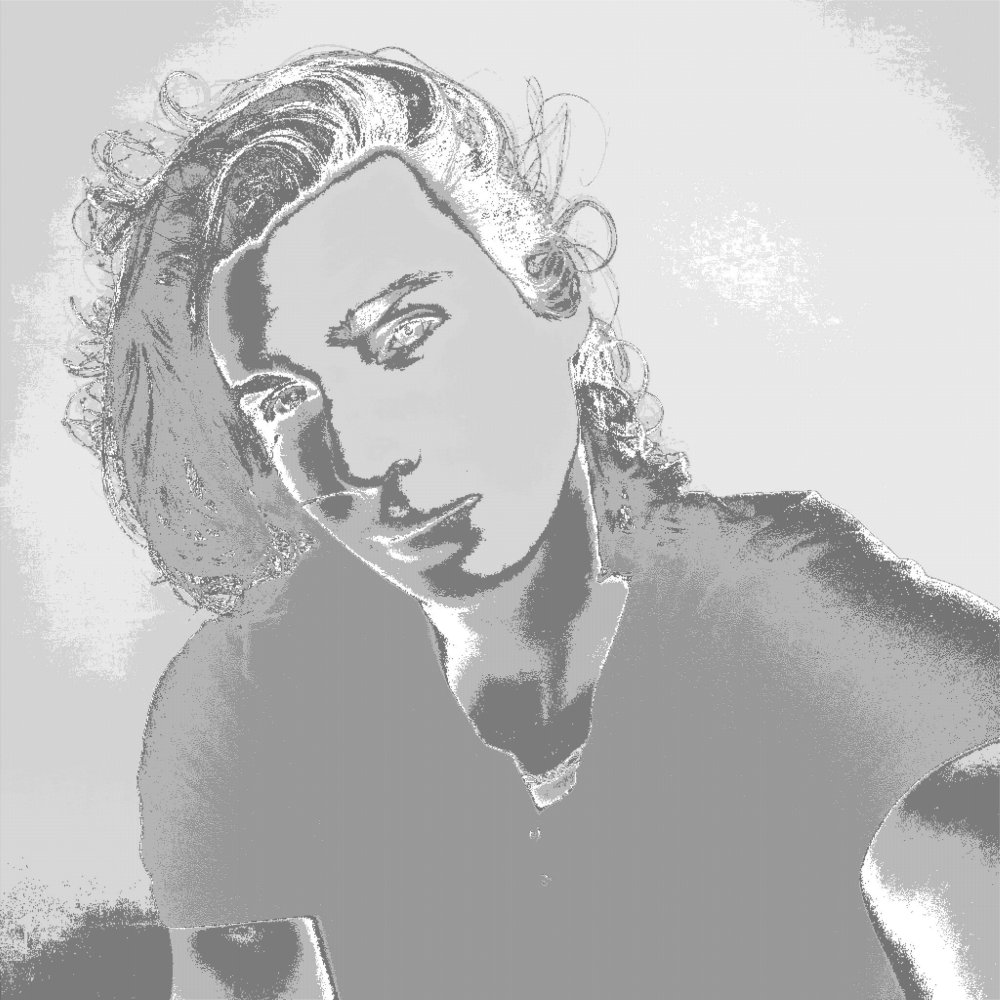

# ASCII Art

## Abstract
Process an image to create ASCII Art. 

Output can be a text file (*.txt*) or an image (*.jpg*, *.png*). You can tune the different optionnal parameters of [scripts](#Scripts) to change the output result.

|  |  |  | 
|:-:|:-:|:-:| 
|  |  |  | 
|  |  |  | 

## Packages
*Using Python 3.8.0*

[OpenCV (4.4.0)](https://anaconda.org/conda-forge/opencv)
`conda install -c conda-forge opencv`

[Pillow (8.0.0)](https://anaconda.org/conda-forge/pillow)
`conda install -c conda-forge pillow `

## Scripts
### Description
* [main.py](./main.py), Main script to generate ASCII Art from a source image. You can override default parameters with the following argurments.

    * `-i, --input` : Path to the input image (can be a video or you camera)
    * `-o, --output` : Path to the output file
    * `-r, --rows` : Number of ASCII rows
    * `-c, --columns` : Number of ASCII columns
    * `-d, --dictionnary` : Choose a dictionnary to use (simple, complex, vberthet)
    * `-f, --font` : [IMG only] Font to use
    * `-fs, --fontSize` : [IMG only] Size of the font
    * `-bg, --background` : [IMG only] Background color
    * `--debug` : Enable debug and show results
    * `--txt` : Force output to *.txt* file
    * `--unsave` : Force to unsave the output file

* [CameraOpenCV.py](./CameraOpenCV.py), script use to manage OpenCV camera object

### Run 
#### Using image input
**TXT :** `python main.py -i sample.jpg -o sample.txt -r 256 -c 256 -d vberthet --debug --txt`

**IMG :** `python main.py -i sample.jpg -o sample.png -r 256 -c 256 -d vberthet -f fonts/deja-vu/DejaVuSansMono-Bold.ttf -fs 8 -bg 255 --debug`

#### Using video input
**Device Camera :** `python main.py -i 0 -r 100 -c 100 -d vberthet -f fonts/deja-vu/DejaVuSansMono-Bold.ttf -fs 8 -bg 255 --debug`

**Video File :** `python main.py -i sample.mp4 -r 100 -c 100 -d vberthet -f fonts/deja-vu/DejaVuSansMono-Bold.ttf -fs 8 -bg 255 --debug`